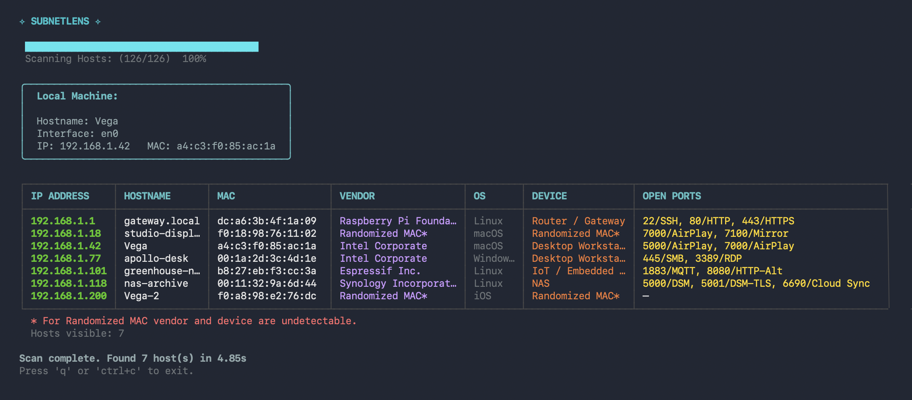

# ✧ Subnetlens ✧


A fast, concurrent network scanner with a TUI and plain-text CLI, built in Go.

Supports multiple discovery methods:

- TCP connect scan (no elevated privileges required)
- ICMP echo (requires root / administrator)
- ARP scan (Linux/macOS; Windows requires Npcap)
- mDNS (passive) — listen for local service announcements

## Features

- **Host discovery** (TCP, ICMP, ARP)
- **Port scanning** (TCP connect)
- **OS & Device Fingerprinting:** Heuristically detects operating systems and device types.
- **Vendor & MAC Resolution:** Uses OUI databases to identify device vendors and detects randomized MAC addresses.
- **Streaming TUI:** A visual interface built with [Charm's Bubbletea](https://github.com/charmbracelet/bubbletea).
- **Plain Text Mode:** Script-friendly output.
- **Single binary**

## Preview



## OUI database (optional)

To build from source fully fledged app you need OUI tables for MAC vendor resolution. You can download it in scv format from [https://regauth.standards.ieee.org](https://regauth.standards.ieee.org). If omitted, vendor lookup falls back to a built-in stub table.

Place it at:

```bash
scanner/oui.csv
```

**Required only when building from source: the prebuilt binary ships with a built-in full OUI table.**

## Quick Start

If you want to download repo and build your binary, follow the instruction below. To run a downloaded precompiled binary, read further.

To clone the repository and build from source, follow the instructions below.
To use a precompiled binary, see [Install precompiled build](#install-precompiled-build).

**Note:** On macOS and Linux, run with `sudo` to enable ARP and ICMP. On Windows, run the terminal as Administrator. TCP scan requires no elevated privileges.

### Development

```bash
git clone https://github.com/ostefani/subnetlens
cd subnetlens

# ---Install dependencies---
go mod tidy

# ---Build---
go build .
# or
go build -o subnetlens

# ---Run---
subnetlens scan <target>
```

### Debug mode

```bash
# Into console
sudo SLENS_DEBUG=1 ./subnetlens scan <target> --plain
# Into file
sudo SLENS_DEBUG=1 ./subnetlens scan <target> --plain 2>debug.log
# Print from file
cat debug.log
```

### Update dependencies

```bash
go get -u all
```

### Install with Go

```bash
cd subnetlens
go install .
```

### Install precompiled build

```bash
sudo mv subnetlens /usr/local/bin/
```

## Usage

### Scan Your Own Machine

Check interfaces and their assigned IPs. Scan only the subnet that matches your WiFi interface (`en0`) to stay on your home network.

```bash
ip addr                      # Linux
ifconfig  | grep "inet "     # macOS
```

```bash
subnetlens scan [subnet] [flags]
```

**Flags:**
`-p`, `--ports` string Comma-separated ports to scan (default: common 23 ports)
`-t`, `--timeout` int Per-connection timeout in ms (default: 500)
`-c`, `--concurrency` int Parallel goroutines (default: 100)
`-b`, `--banners` Grab service banners
`--plain` Plain text output (no TUI)

## Platform Support

| Feature  | Linux    | macOS    | Windows            |
| -------- | -------- | -------- | ------------------ |
| TCP scan | ✔        | ✔        | ✔                  |
| ICMP     | ✔ (root) | ✔ (root) | ✔ (admin)          |
| ARP      | ✔        | ✔        | ✔ (Npcap required) |
| mDNS     | ✔        | ✔        | not tested         |

**Windows prerequisite:** Active ARP scanning requires [Npcap](https://npcap.com) — a kernel-level packet capture driver. If you have Wireshark installed, Npcap should be already present.

**Examples:**

```bash
  subnetlens scan <IP>
  subnetlens scan <IP start>-<IP end>
  subnetlens scan <IP> --ports 22,80,443,8080
  subnetlens scan <IP> --plain --banners
  subnetlens scan <IP> --concurrency 200 --timeout 300
```

## Project Structure

```
subnetlens /
├── main.go               # Entrypoint
├── cmd/
│   └── root.go           # Cobra CLI commands
├── scanner/
│   ├── arp.go
|   ├── discovery.go
│   ├── engine.go
│   ├── helpers.go
│   ├── icmp.go
│   ├── osdetect.go
│   └── oui.csv        # is not included in the repo, download from https://regauth.standards.ieee.org if building locally
├── models/
│   └── models.go
└── ui/
    └── tui/
        └── tui.go
```

## Roadmap

- [x] ARP-based host discovery (requires raw sockets / root)
- [x] MAC address vendor lookup
- [x] mDNS listening
- [ ] Add tests
- [ ] Scan profiles: `--all-alive | --all`
- [ ] UDP port scanning
- [ ] JSON / CSV export (`--output result.json`)
- [ ] GUI with interactive network node graph
- [ ] `subnetlens watch` — re-scan on interval, alert on changes

## Contributing

To contribute, please consult CONTRIBUTING.md about PR requirements.

## License

MIT © 2026 Olha Stefanishyna

**Disclaimer:** This tool is intended for authorized network testing and diagnostics only. Do not scan networks or systems without explicit permission. Use responsibly.
